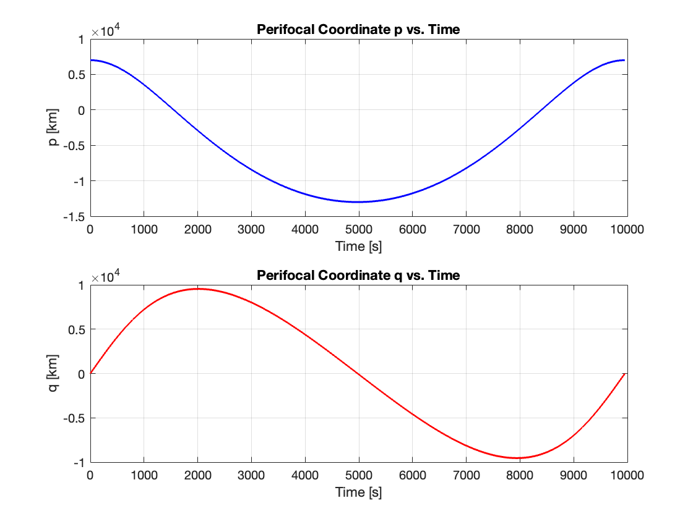
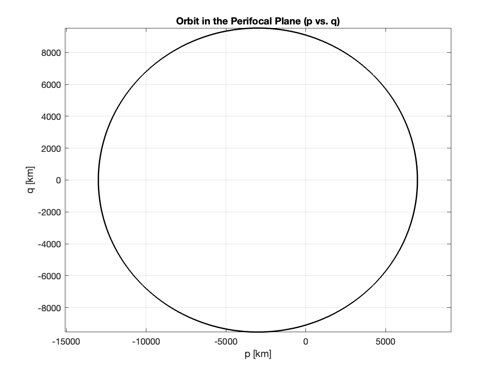
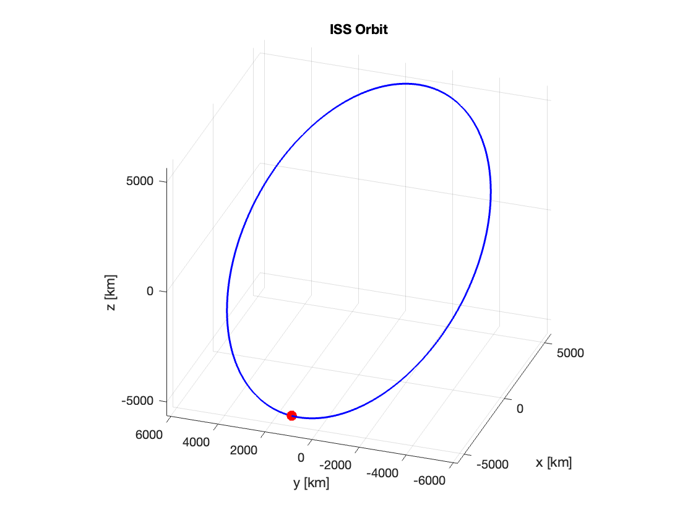
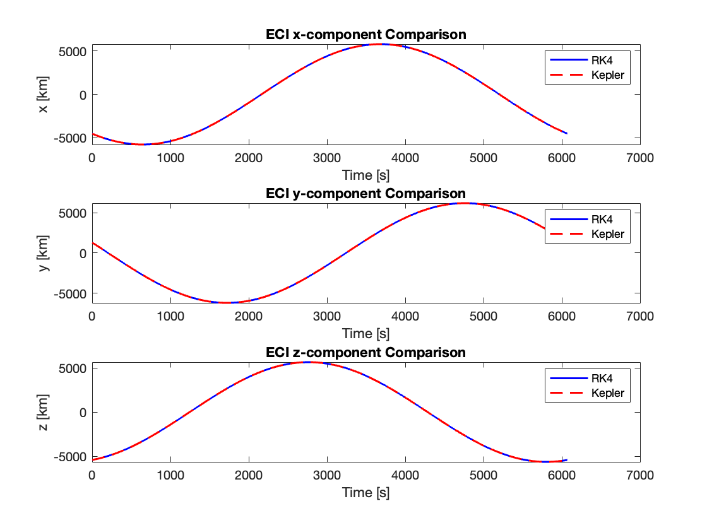
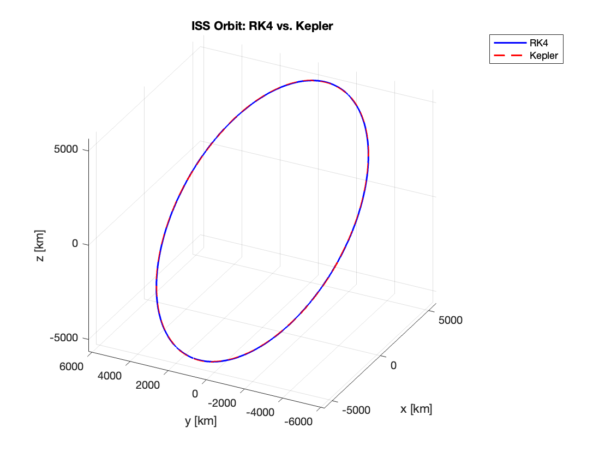

# Homework 1

## Question 1

Angular momentum vector (h) km^2/s:
- 40553.6          
- 3538.6         
- 31830.5 

Specific energy (E) km^2/s^2 :
- -29.4569

## Question 2

## Question 3
- Inclination (i):              51.9771 deg
- Right Ascension of AN (RAAN): 94.9868 deg
- Semi-major axis (a):          6765.8119 km
- Eccentricity (e):             0.099232
- True anomaly (nu):            299.5411 deg
- Argument of perigee (omega):  93.4561 deg

## Question 4
Computed State Vectors from OE -> RV:
- r_ECI = [-2599.9955  5150.0036    2739.9957] km
- v_ECI = [-3.51       -5.29        5.06] km/s
 
Given State Vectors (for comparison):
- r_given = [-2600  5150  2740] km
- v_given = [-3.51       -5.29        5.06] km/s

## Question 5

## Question 6

