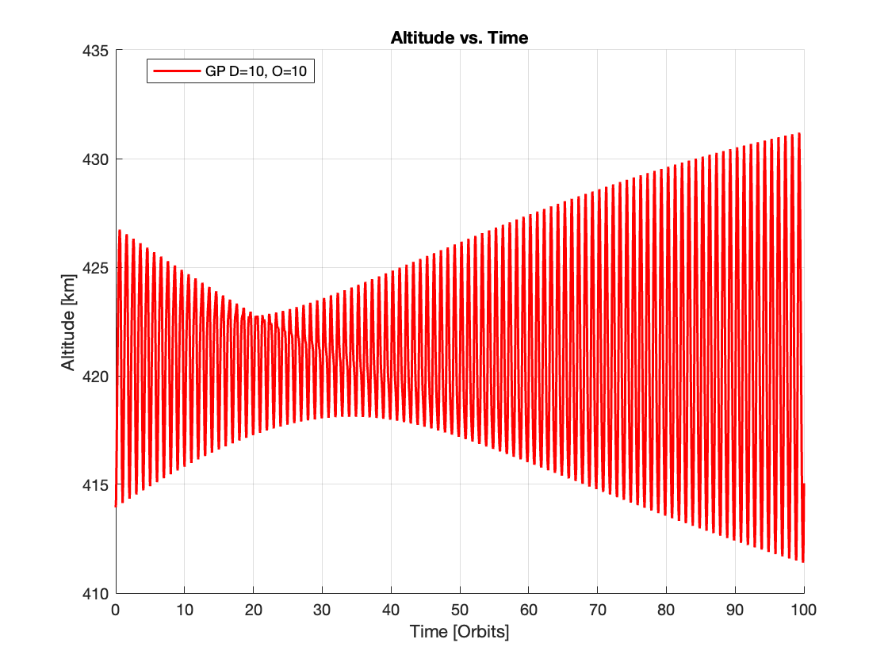
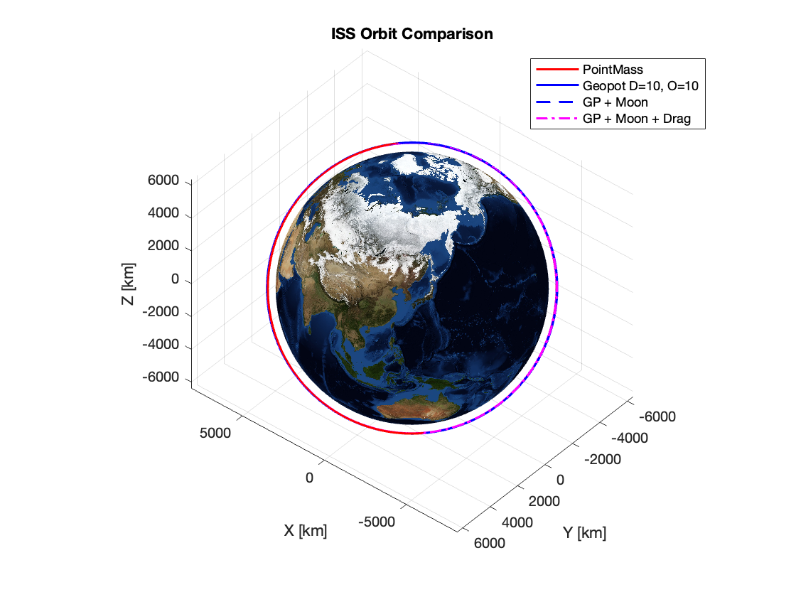
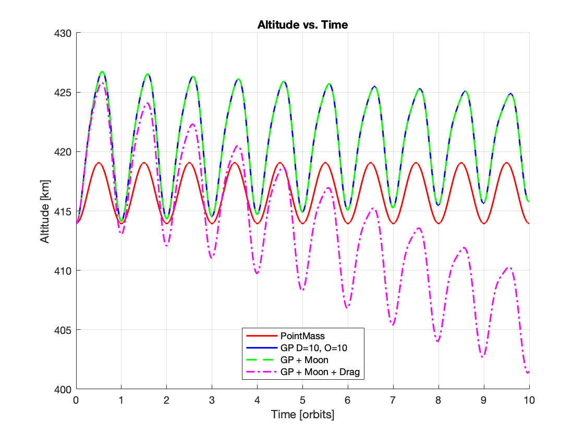
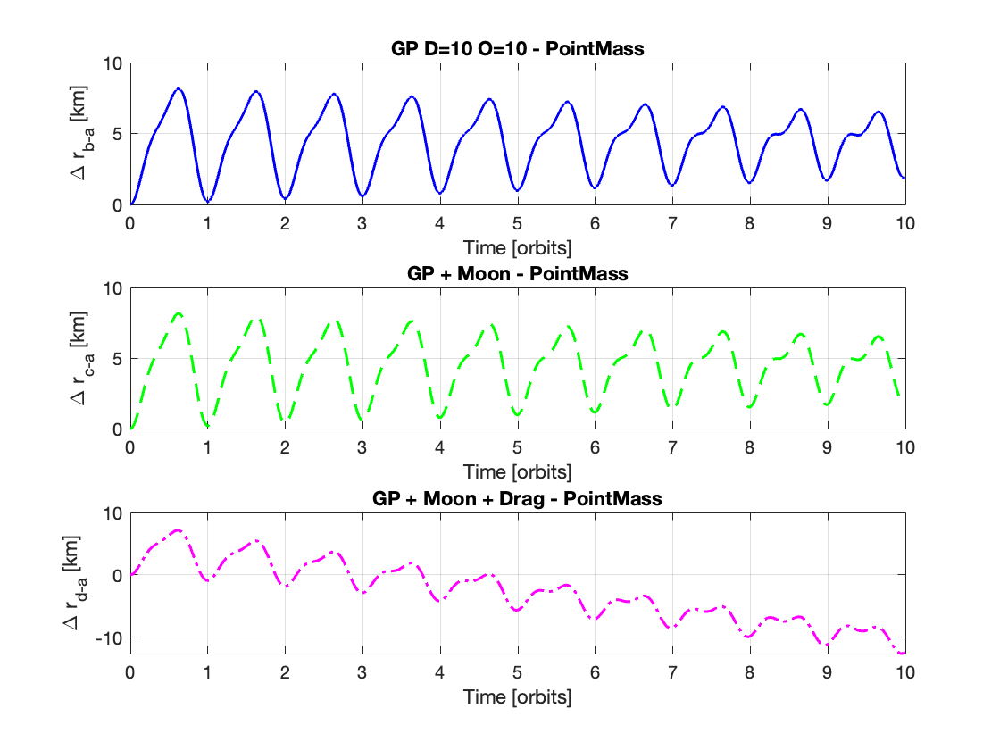

# Homework 2

## Testing

### `test_get_accel_geopotential.m`
```terminal
===== Point-Mast Test =====
Computed a_grav_eci_pm (km/s^2):
    0.0055
   -0.0016
    0.0065

Analytical a_pm (km/s^2):
    0.0055
   -0.0016
    0.0065

Error (km/s^2):
     0

Test passed!
===== Deg=10, Ord=10 Test =====
Computed a_grav_eci_20 (km/s^2):
    0.0054
   -0.0016
    0.0065

Ref  a_ref_20 (km/s^2):
    0.0054
   -0.0016
    0.0065

Error (km/s^2):
   4.9826e-18

Test passed!
```

### 'test_gp_d10_o10_longterm.m`




### `test_get_accel_moon_grav.m`
```terminal
===== Moon Gravity Test =====
Computed a_moon_eci (km/s^2):
   1.0e-09 *

    0.2521
   -0.6546
    0.1730

Analytical a_moon_eci (km/s^2):
   1.0e-09 *

    0.2433
   -0.6583
    0.1612

Error norm (km/s^2):
   1.5248e-11

Test passed!
```

### `test_get_accel_drag.m`
```terminal
===== Drag Acceleration Test =====
Altitude (km): 413.9425
rho value: 5.9938e-12
Computed a_drag_eci (km/s^2):
   1.0e-06 *

    0.0822
    0.1349
   -0.0367
```

## Plots / Visualizations

### Scenarios



