# Homework 3

## Unit Test

### `test_lambertSolverBisection.m`
```terminal
Geometric params: 
r1mag = 6878.1274, r2mag = 11867.2422, 
c = 14828.7749, s = 16787.0723, a_min = 8393.5361
Minimum flight time (parabolic transfer) t_min = 1559.2999 s
Maximum transfer time t_max = 3759.3497 s
Short-way transfer checked


Starting LambertSolverBisection
Iter  1: a_min = 8393.536132, a_max = 41967.680661, a_mid = 25180.608397, dt_mid = 1758.21 s
Iter  2: a_min = 8393.536132, a_max = 25180.608397, a_mid = 16787.072264, dt_mid = 1900.54 s
Iter  3: a_min = 8393.536132, a_max = 16787.072264, a_mid = 12590.304198, dt_mid = 2099.34 s
...
...
...
Iter 34: a_min = 10180.957729, a_max = 10180.957733, a_mid = 10180.957731, dt_mid = 2400.00 s
Iter 35: a_min = 10180.957729, a_max = 10180.957731, a_mid = 10180.957730, dt_mid = 2400.00 s


Converged after 35 iterations: a_t = 10180.957730 km
The required delta-v is 3.9411 km/s
```

### `test_ECI2LVLH.m`
```terminal
=== ECI to LVLH Transformation ===
Relative Position (LVLH): [176.9352, 63.4545, 350.1513] km
Relative Velocity (LVLH): [-0.0630, -0.0963, -0.1129] km/s
Rotation Matrix (ECI to LVLH):
   -0.6323    0.1803   -0.7534
   -0.4981   -0.8395    0.2171
   -0.5934    0.5126    0.6206
```
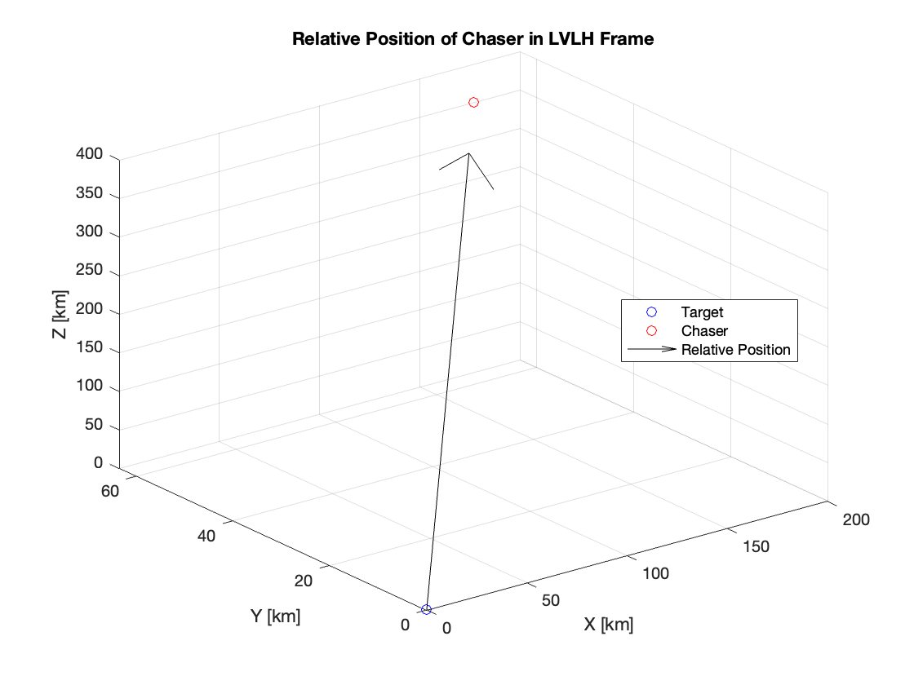

## Results

### `hw31_tangent_burn.m`

Brute-force version

```terminal
Starting at PERIGEE (r1 < r2).
The transfer eccentricity is 0.1564

=== ONE-TANGENT-BURN ===
r1         = 6678.0 km
r2         = 8378.0 km
nu_tb      = 120.0 deg
e_t        = 0.1564
a_t        = 7916.4 km
v_trans_a  = 8.3082 km/s
v_circ1    = 7.7258 km/s
DV1        = 0.5824 km/s
v_trans_b  = 6.6935 km/s
v_circ2    = 6.8976 km/s
phi_b      = 8.361 deg
DV2        = 1.0115 km/s

Time of flight (a -> b) = 2016.6 s
a_thrust_a1 [km/s^2] = 
    0.0058

a_thrust_b2 = 
    0.0025
   -0.0098
         0
```

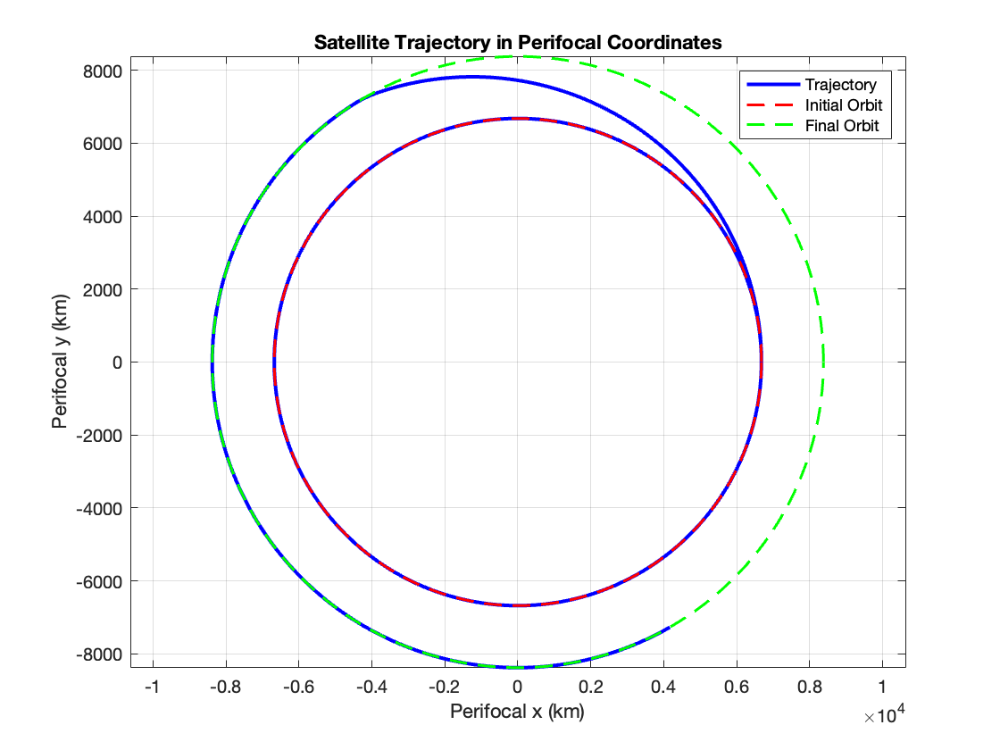

### `hw32_intercept.m`
```terminal
The required delta-v is 3.9411 km/s
The burn duration is 350.00 s
The miss distance at tf is 68.8523 km
```


### `hw33_rdv.m`
```terminal
Eigenvalues of A_alpha:
  -0.0020 + 0.0000i
  -0.0020 + 0.0000i
  -0.0020 + 0.0011i
  -0.0020 - 0.0011i
  -0.0020 + 0.0011i
  -0.0020 - 0.0011i

Size of K:
     3     6

Max Control Input Norm [N]:
    3.6194

```

Case: Controller OFF

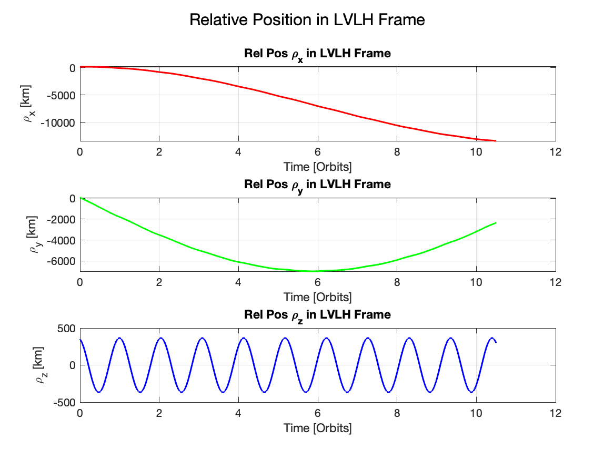
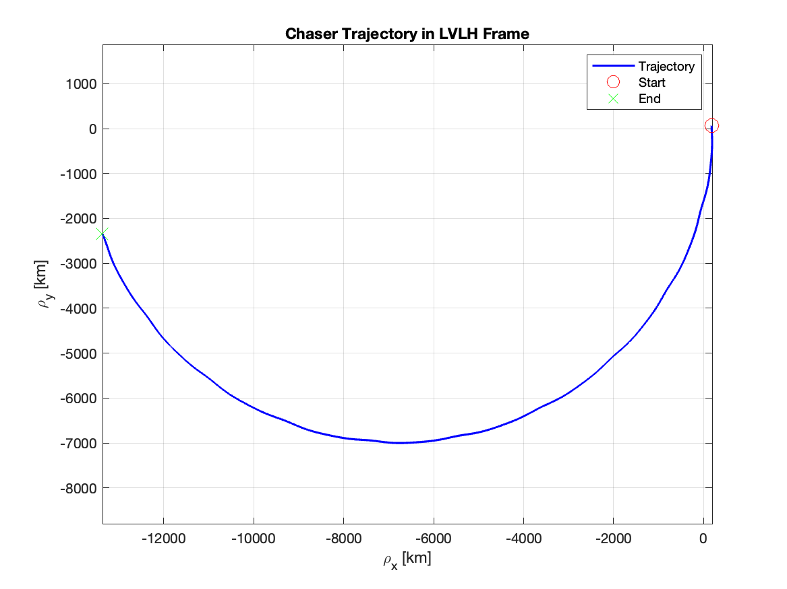
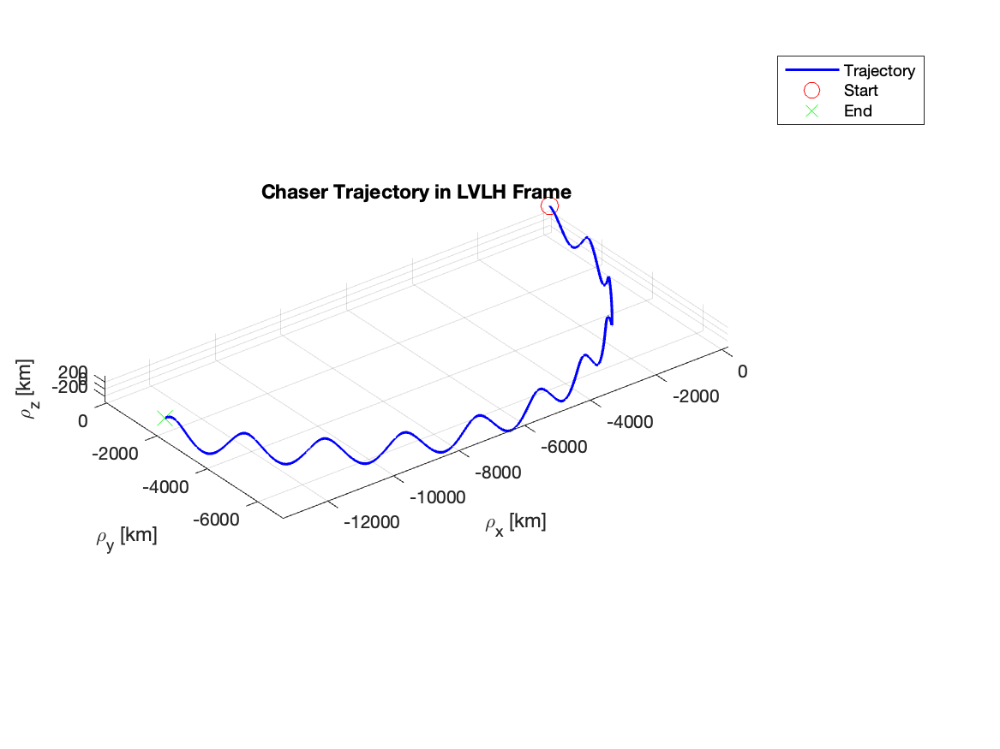
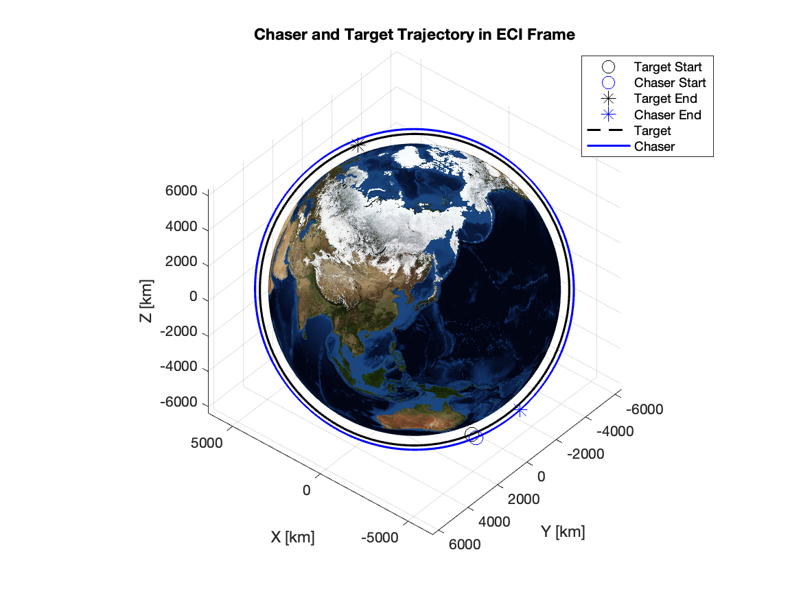


Case: Controller ON

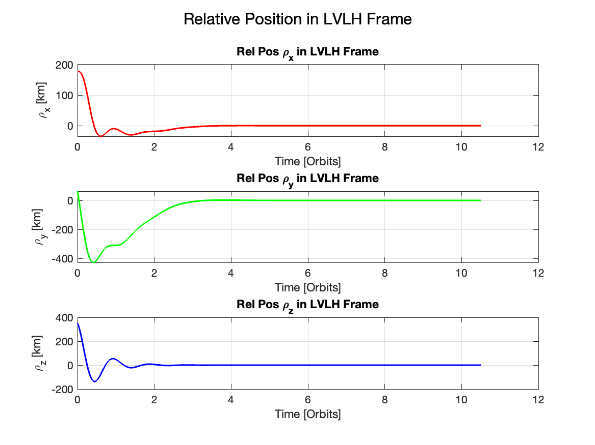
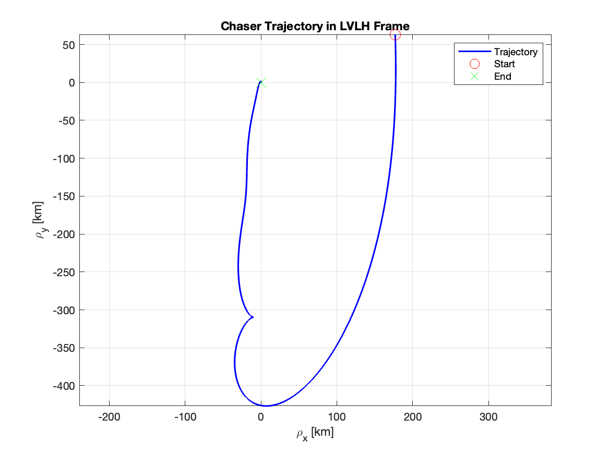
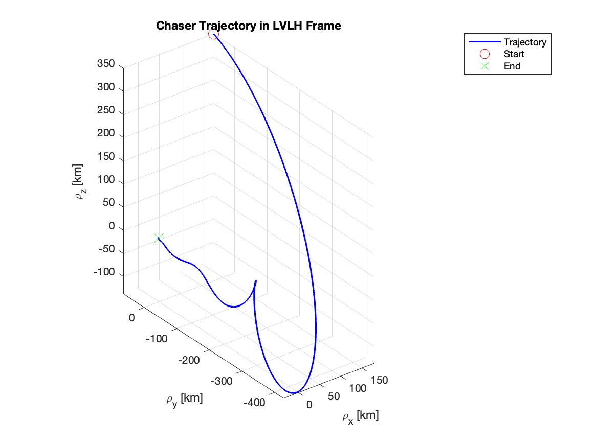
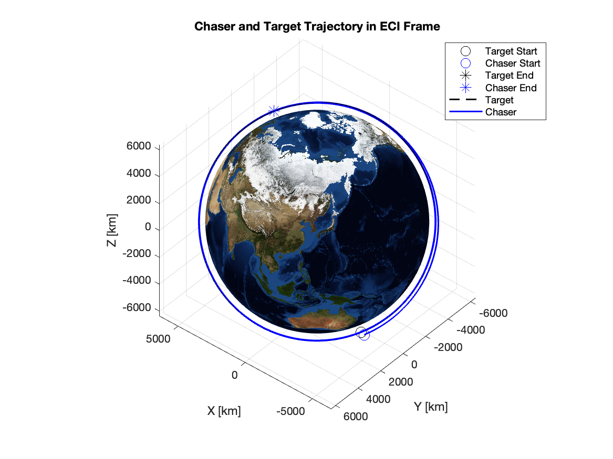
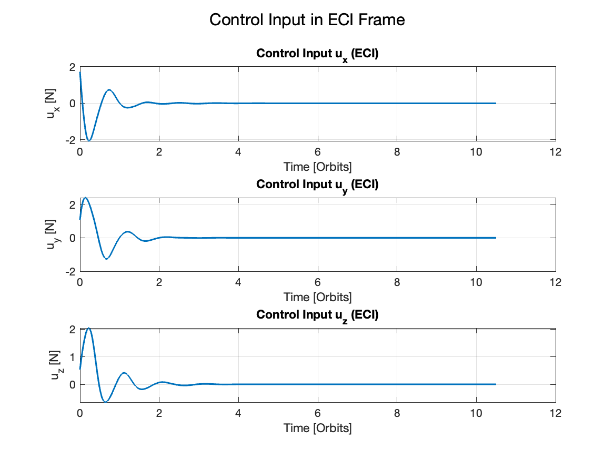