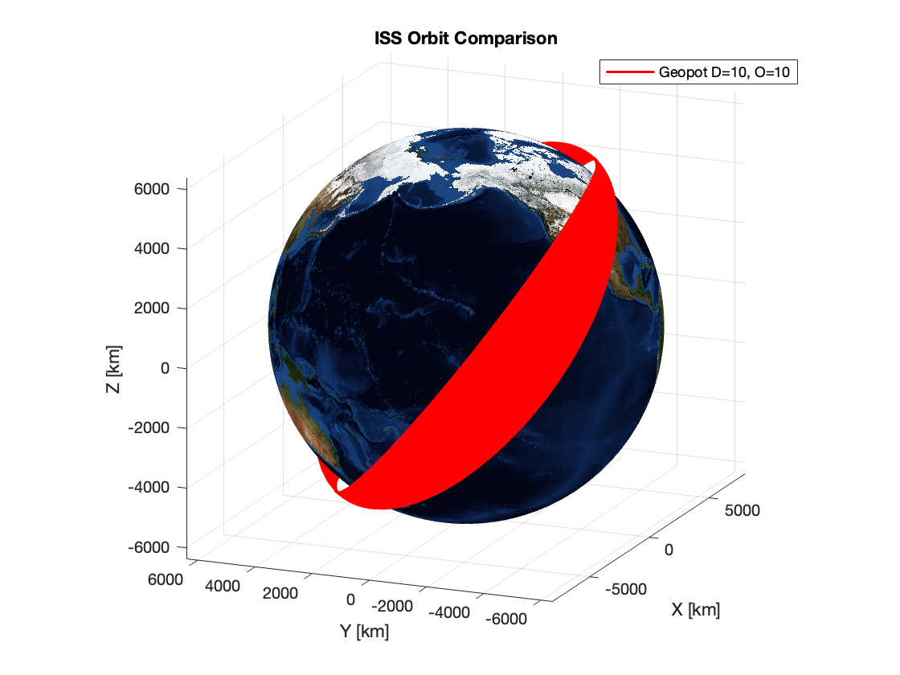
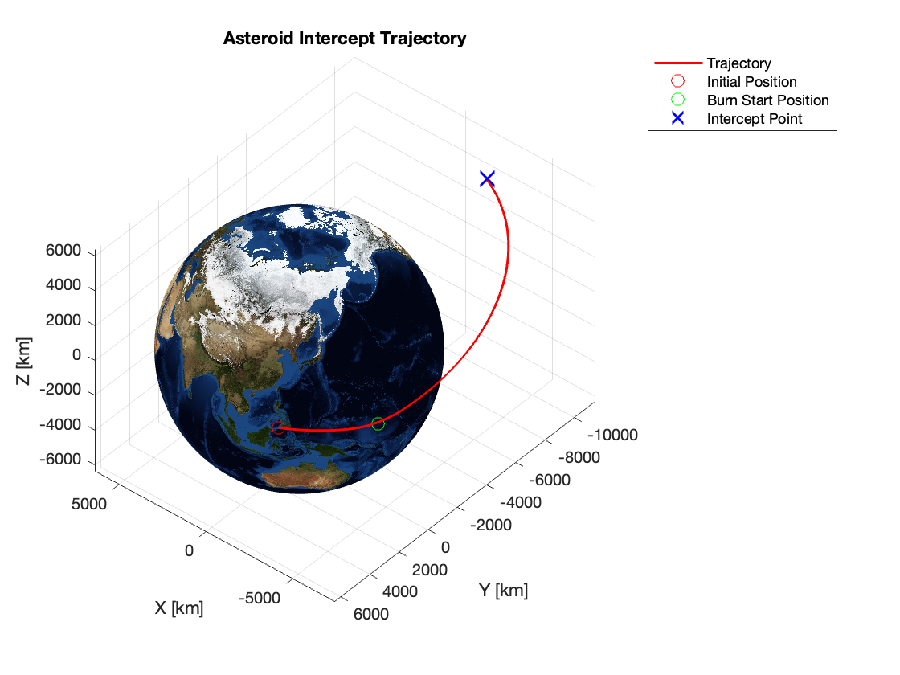

# Spaceflight Mechanics and Controls

**AEE-5805: Spaceflight Mechanics and Controls** at Florida Institute of
Technology (Spring 2025). It is a learning portfolio, not flight-qualified
software.

## Highlights

### Geopotential orbit propagation — HW2

ISS-orbit propagation using the coursework geopotential configuration with
degree 10 and order 10.



### Asteroid intercept trajectory — HW3

Coursework intercept trajectory with the initial position, burn start, and
target intercept point shown in ECI coordinates.



## Homework collection

| Folder | Focus | Entry point |
| --- | --- | --- |
| [`HW1`](HW1/) | Orbital elements, Kepler solution, two-body propagation, and RK4 integration | [`HW1/README.md`](HW1/README.md) |
| [`HW2`](HW2/) | Perturbed-orbit propagation: drag, geopotential effects, lunar gravity, and Harris-Priester density | [`HW2/README.md`](HW2/README.md) |
| [`HW3`](HW3/) | One-tangent-burn transfer, Lambert targeting, ECI-to-LVLH conversion, and rendezvous control | [`HW3/README.md`](HW3/README.md) |
| [`HW4`](HW4/) | Coupled two-body orbit and rigid-body attitude dynamics using quaternions | [`HW4/README.md`](HW4/README.md) |
| [`common`](common/) | Shared MATLAB utilities used across homework folders | [`common/README.md`](common/README.md) |
| [`Viz`](Viz/) | MATLAB satellite-scenario visualization scripts | [`Viz/README.md`](Viz/README.md) |

## Running the work

The scripts were written in MATLAB during the course and have not been
refactored for this public release. Open MATLAB at the repository root, add the
relevant homework folder and `common/` to the path, then run an entry-point
script from that folder. For example:

```matlab
addpath('HW4', 'common')
hw4
```

Requirements vary by script.

The Earth texture, visualization models, and saved visualization datasets used
by the preserved scripts are included. See
[`ASSET_ACKNOWLEDGMENTS.md`](ASSET_ACKNOWLEDGMENTS.md) for the Earth-texture
credit.
